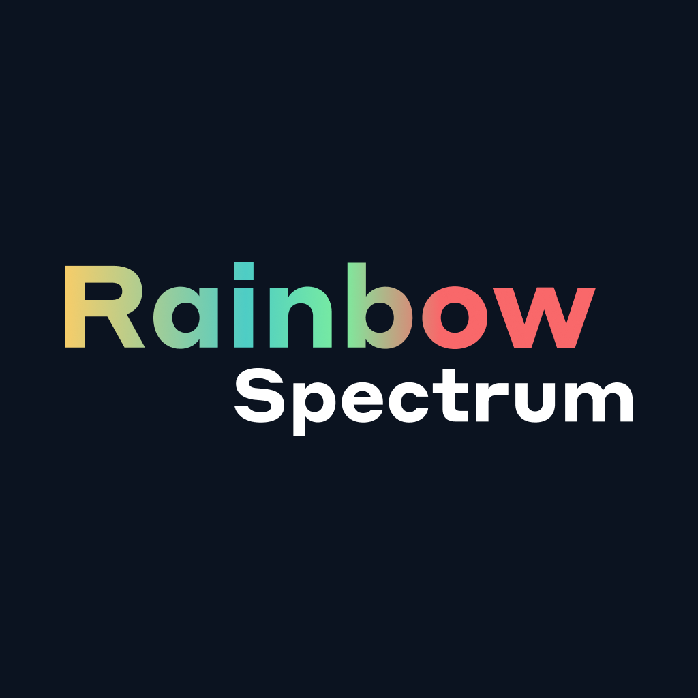
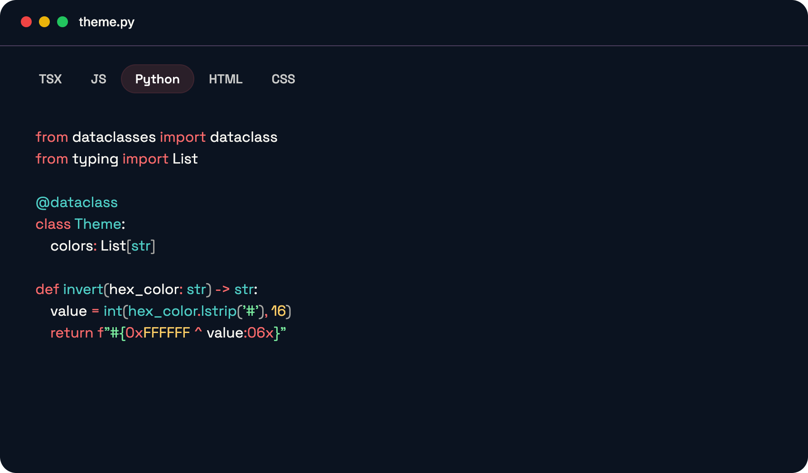
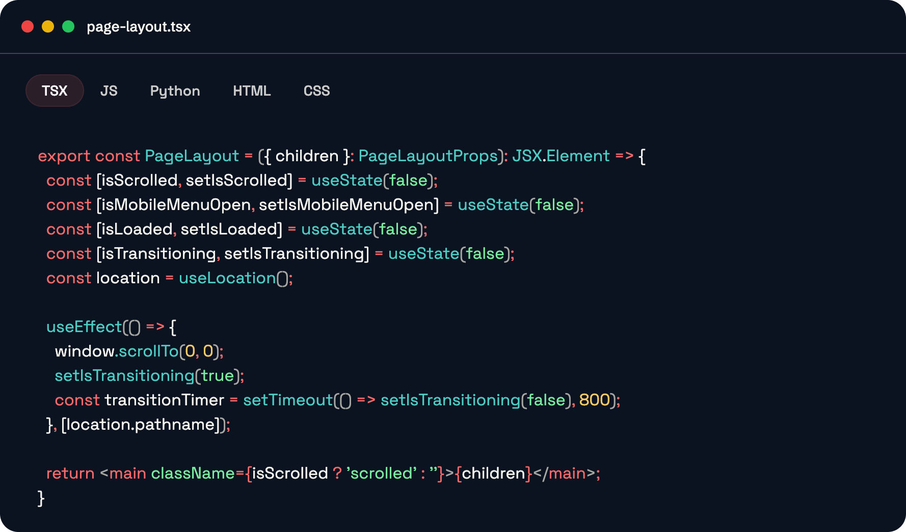

# Rainbow Spectrum Theme

A beautiful VS Code theme generated by Codedye that brings vibrant colors to your coding experience.

## Preview

### Icon

### Python Syntax Highlighting

### TypeScript/TSX Syntax Highlighting

## Installation

1. Open VS Code
2. Go to Extensions (`Ctrl+Shift+X` / `Cmd+Shift+X`)
3. Search for "Rainbow Spectrum"
4. Click Install
5. Go to File > Preferences > Color Theme and select "Rainbow Spectrum"

## Features

- Rich syntax highlighting for multiple languages
- Dark theme optimized for extended coding sessions
- Vibrant color palette that enhances code readability
- Support for popular languages including Python, TypeScript, and more

## License

This project is licensed under the MIT License - see the [LICENSE](LICENSE) file for details.

## Contributing

Feel free to submit issues and enhancement requests!
